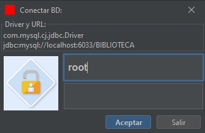
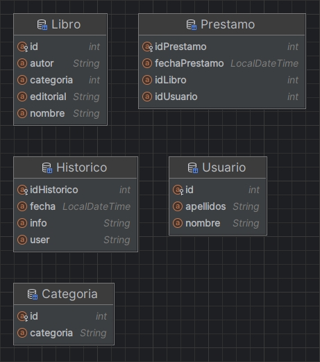
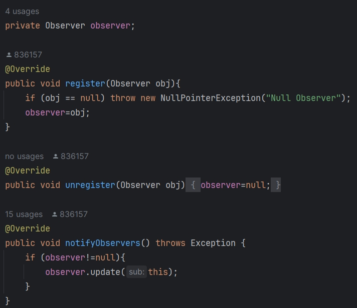
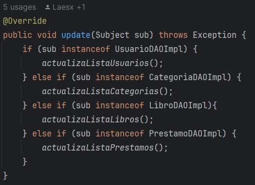

# Proyecto GestionBibliotecaHibernate 🚀

## Integrantes del Grupo 👥

- 👨‍💻 Juan Manuel Sújar González
- 👨‍💻 Sebastián Olea Castillo
- 👨‍💻 José María La Torre Ávila
- 👨‍💻 Eric de ***REMOVED*** ***REMOVED***

## Objetivo del Trabajo 🎯
**1. Cambiar la integración de la base de datos de SQL a JPA Hibernate.** 

El objetivo principal de este proyecto es llevar a cabo la adaptación de la biblioteca utilizando un modelo JPA Hibernate en lugar de SQL convencional. Este cambio busca mejorar la eficiencia y la flexibilidad en la gestión de la base de datos.

**2.Mantener el modelo vista-controlador (MVC).**

Además, nos proponemos mantener la integridad del modelo vista-controlador (MVC), asegurando que la arquitectura del proyecto permanezca organizada y escalable.

**3. Implementar el patrón Observer.**

Esto permitirá una comunicación eficiente y desacoplada entre los componentes, proporcionando una mayor modularidad y extensibilidad al sistema.

Estos objetivos no solo mejoran la tecnología subyacente del proyecto, sino que también fortalecen los principios de diseño y la arquitectura general, contribuyendo así a un desarrollo más robusto y sostenible.

[//]: # (Eric)
 ## Creación del Proyecto🛠️
 
Iniciamos nuestro proyecto creando un proyecto Maven desde cero. El cual conectamos con Hibernate, conectamos con
la base de datos y mapeamos la misma.

### Login y Experiencia del Usuario 🔐
Uno de los primeros pasos fue adaptar el panel de login para que se conecte a la base de datos a través de 
Hibernate y compruebe si el usuario y la contraseña son correctos.

A su vez se ha mantenido toda la funcionalidad que ya existía como la encriptación de la contraseña en el archivo de configuración. 
O la funcionalidad que recuerda el último usuario que se conectó a la aplicación, para no tener que volver a 
introducir sus credenciales cada vez que inicie sesión. 

## Conexión y Mapeado de la Base de Datos 📊

Se ha usado una versión modificada de `HibernateJPAUtil`, que se encuentra en el paquete `singleton`. 
Esta clase contiene métodos para establecer la conexión con la base de datos y mapear las entidades a la misma.

### Mapeado de Entidades

En la imagen podemos ver como se han mapeado las entidades de la base de datos.
Tuvimos que hacer algunas modificaciones posteriores, principalmente que las llaves
foráneas en vez de ser objetos sean sus primitivos, podemos ver que en la clase `Prestamo` idLibro 
en vez de ser un objeto `Libro`, es un integer con la id del libro directamente.

Ya que haciendolo de otra manera nos daba problemas a la hora de hacer las consultas.

### Configuración Centralizada ⚙️
Toda la configuración de la base de datos viene centralizada en el archivo `biblioteca.config`, 
que se encuentra en la carpeta `ficheros`.

Usamos la clase singleton `configuracion` que se encarga de leer el archivo `biblioteca.config` y de establecer 
los valores de conexión de Hibernate en la clase `HibernateJPAUtil` con los valores del archivo.

[//]: # (Juanma)
## Implementación de Hibernate 💼

En nuestro proyecto, la implementación de Hibernate se ha llevado a cabo con un enfoque estructurado y eficiente para 
gestionar la interacción con la base de datos. La capa de modelo, compuesta por los paquetes `modelo` y `dao`, 
desempeña un papel crucial en esta implementación, proporcionando una representación coherente y organizada de 
los datos en nuestra aplicación.

### Paquete `modelo`

El paquete `modelo` almacena las clases que representan las entidades fundamentales de nuestra aplicación, como `Autor`, `Categoria`, etc. Cada clase en esta carpeta encapsula los datos específicos y las relaciones necesarias entre las entidades. Estas clases actúan como una abstracción clara de la estructura de la base de datos relacional.

### Paquete `dao` (Data Access Object)

El paquete `dao` consiste de interfaces que detallan la forma de implementar cada clase y de sus implementaciones con Hibernate. 

Aquí, cada DAO corresponde a una entidad específica, como `AutorDAO`, `CategoriaDAO`, etc. Cada DAO proporciona 
métodos para realizar operaciones CRUD, facilitando la manipulación de las entidades en la base de datos.

### Cambio de SQL a JPA

Durante la migración de SQL a JPA Hibernate, las implementaciones de los DAO han experimentado cambios significativos. 
Hemos adaptado las consultas SQL a JPQL (Java Persistence Query Language), aprovechando las capacidades de abstracción de Hibernate. 

Este cambio no solo simplifica las consultas, sino que también las hace más orientadas a objetos, 
mejorando la coherencia y la flexibilidad del acceso a datos.

### Métodos Generales en la Capa DAO

Hemos introducido una clase en el paquete `dao` que contiene métodos generales que funcionan para cada uno de los objetos.
Con el objetivo de no repetir codigo y hacer la aplicación más mantenible.

Por ejemplo, un método que devuelve una lista de autores, categorías, etc. Como objetos genéricos, que posteriormente podemos castear 
a una lista de objetos que queramos. 
Esta abstracción simplifica y unifica el acceso a datos, mejorando la modularidad y la mantenibilidad del código.

<!--
Hemos introducido una clase en el paquete `dao` que contiene métodos generales para recuperar listas de cada uno de los objetos. 
Estos métodos ofrecen una interfaz uniforme y reutilizable para acceder a datos comunes en toda la aplicación. 
Por ejemplo, métodos que devuelven listas de autores, categorías, etc. Esta abstracción simplifica y unifica el acceso a datos, 
mejorando la modularidad y la mantenibilidad del código. -->

[//]: # (Sebas y Eric)
## Implementación del Observer 🔄

Dentro de nuestro proyecto, hemos incorporado el patrón Observer para mantener una comunicación desacoplada y eficiente 
entre las diferentes capas. La implementación se encuentra en un paquete dedicado llamado `observer`, que contiene dos 
interfaces clave: `Observer` e `Subject`.

### Interfaces del Observer

#### `Observer`

La interfaz `Observer` define un método `update` que será implementado por todas las clases interesadas en recibir 
notificaciones cuando haya cambios en el `Subject`.

#### `Subject`

La interfaz `Subject` detecta los cambios y notifica a los observadores registrados. 
Contiene métodos como `register` para añadir nuevos observadores y `notifyObserver` para informar a los observadores sobre los cambios.

> El "Observador" observa al "Sujeto" y este le notifica cuando hay un cambio, a partir de ahi el "Observador" actuará 
> de la forma que el desarrollador determine.

 Cuando se llama al notificador

 Implementación de la interfaz Sujeto

### Implementación en Clases DAO

Las propias implementaciones de las interfaces DAO tambien implementan la interfaz `Subject` es la encargada de detectar 
cambios en el sistema, como inserciones, modificaciones o eliminaciones. 
Cuando se produce uno de estos cambios, se utiliza el método `notifyObserver` para informar a los observadores registrados.

### Observador en FormMain

El `FormMain` actúa como un observador en nuestro sistema. Cuando recibe una notificación a través del método `update`,
primero verifica el tipo de cambio (ya sea libro, prestamo, categoria o usuario) y luego llama a la función correspondiente
para actualizar la interfaz de usuario de manera apropiada.

### Extra

La implementación del patrón Observer es muy útil ya que permite una mayor 
modularidad y flexibilidad en el desarrollo. No tenemos que tener en cuenta _que_ está cambiando los datos, ya que las
propias clases que modifican esos datos se encargan de notificar a los observadores cuando se producen cambios.

Además, nuevos observadores pueden ser fácilmente añadidos para responder a futuros cambios 
en el sistema sin afectar otras partes del código.

Este enfoque también mejora la mantenibilidad del código, ya que las clases observadoras pueden ser modificadas o 
extendidas de manera independiente. La estructura organizada del patrón Observer contribuye a un diseño más limpio y 
sostenible.

## Funcionalidad Añadida 🚀
[//]: # (Eric)
### Skin

Añadimos una nueva skin y cambiamos la que trae por defecto, añadiendo la dependencia 'FlatLaf', la cual simplemente
hemos tenido que aplicar antes de que se cree ningún panel de la GUI.

[//]: # (Sebas)
### Log de Sesión y Logs de Sesiones Anteriores dentro de la Apliación

#### Subseccion

También hemos añadido otra pestaña llamada historial, que dentro tiene dos subpestañas: Una llamada cargar logs
que lo que hace es cargar los logs de sesiones anteriores y la otra es logs de sesión actual, en la que visualizas en
una nueva ventana las sentencias que se estan usando en esa sesión para gestionarla.

### Iconos en la Aplicación

[//]: # (Chema)
### Pestaña Ayuda y Créditos

Hemos añadido una pestaña de ayuda nueva, que dentro tiene una subpestaña de créditos donde podemos ver a los creadores 
del proyecto, más al CEO de este, ha sido una funcionalidad añadida divertida y que además da información sobre dichos creadores.

## Problemas Encontrados y Soluciones Aportadas 🚧

UN MONTON DE PROBLEMAS ENCONTRADOS

## Recursos Utilizados 👥

https://www.digitalocean.com/community/tutorials/observer-design-pattern-in-java

